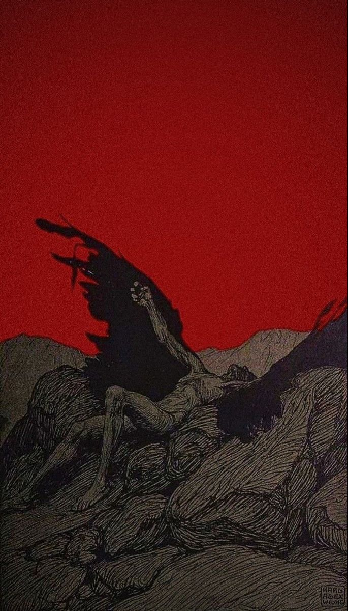
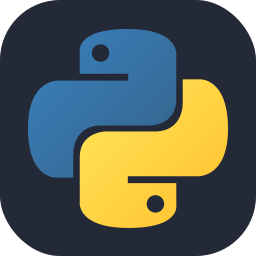
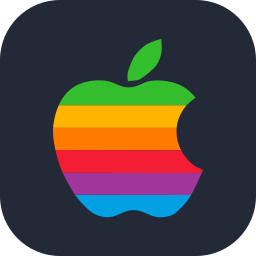

---

<h3 align=center>✦ Welcome to my mink ✦</h3>
<p>I'm just a developer.<br>
Also a bit of a game & sound designer.</p>
<p>⟡ <b>Age:</b> 19 ⟡ <b>English level:</b> B2 ⟡ <b>Main prog language:</b> Python ⟡</p>

___

<h3 align=center>✦ Languages ✦
<br>
<div align=center>
    
    
    
    
</div>

<h3 align=center>✦ Related technologies ✦
<br>
<div>
    
    
    
    
    
    
</div>

<h3 align=center>✦ OS ✦
<br>
<div>
    
    
    
</div>

<br>

<div align="left">
   
```bash
echo "Someone said open‑source is evil. I wanna be a villain then." > me.txt
```

</div>

___
